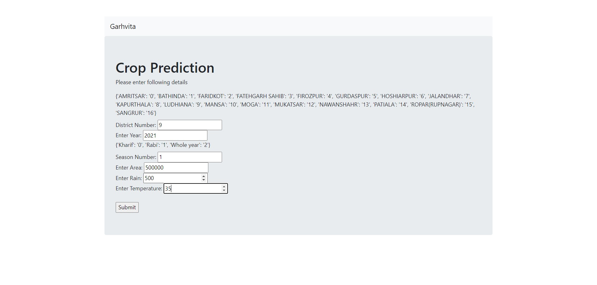
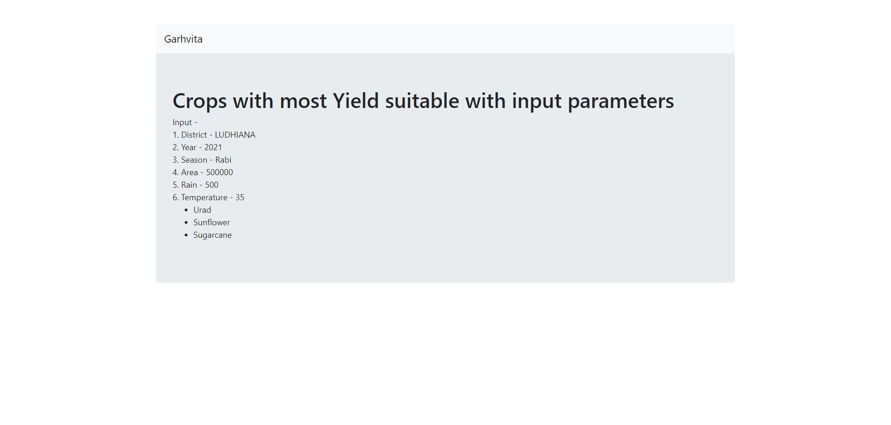

# Prediction of high yield crops

## Data Science Project 1

## Submitted by:-
### Garhvita Sethi
### 101803708
### COE 15

## Introduction-

## Live Link
https://crop-pred-garhvita.herokuapp.com/

## Input


## Output



### Algorithms used
> Linear Regression,
> KNN,
> Random Forest,
> Gradient Boosting

### Get predicted outcomes
``` Run server and enter the required details```

